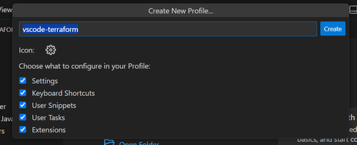

# Setup voor het Event

## Stap 1: Verbind met WiFi

Vandaag heb je WiFi nodig. Gebruik ons gasten-netwerk:

Netwerk: **TechnativeGuest**
Wachtwoord: **J1cZtf9a4qvk1lteo4ul**


## Stap 2: Download bestandje en noteer pad
Je krijgt een mailtje met een bijlage. Het bestand heet `creativexy`, waarbij xy een volgnummer is. Hier gebruiken we volgnummer **04**. Dus het bestand heet `creative04`.

Dit bestand moet in de **Downloads** map staan. Dat is de standaard map waar dingen worden gedownload van mail of internet.

Noteer het **_volledige pad_** naar deze map. Bijvoorbeeld `c:\users\deelnemer\downloads`.

Zo kun je het vinden:

- In de downloads van je browser, klik rechts op het bestand en kies `Weergeven in verkenner`. Noteer het pad bovenaan. (Bijvoorbeeld: **C:\Users\Deelnemer\Downloads**)

of

- Druk in Windows op **WIN** + **R** tegelijk. Er opent een venster waarin je iets kunt typen. Type **%userprofile%** en klik op **Uitvoeren**. Een nieuw venster opent met je Windows Gebruikersnaam bovenaan. Het pad dat je moet onthouden is **c:\users\gebruikersnaam\downloads**.


## Stap 3: Installeer Visual Studio Code

Als je Visual Studio Code nog niet hebt, download en installeer het van de [officiële website](https://code.visualstudio.com/).

## Stap 4: Setup Visual Studio Code

Open Visual Studio Code en doe dit:

- Klik op het blauwe icoontje `><` links onderin.
- Klik op SSH bovenaan in het midden.


Een **extensie** wordt geïnstalleerd. Als dit klaar is:

- Kies `+ Add New SSH Host`.


Nu moet je een commando invullen:

1. Vervang **creative04** door de naam van het bestand dat je hebt gedownload.
2. Vervang **c:\users\gebruiker\downloads** door het pad dat je in **Stap 2** hebt genoteerd.
3. Zet elke backslash `\` twee keer neer.

- Vul dit commando in:

```bash
ssh -i c:\\users\\gebruiker\\downloads\\creative04  -o StrictHostKeyChecking=no creative04@vscodeserver-0.creative.technative.dev
```


- Druk op **enter**.
- Kies `c:\users\gebruiker\.ssh\config`.


Je ziet nu een berichtje onderaan dat er een host is toegevoegd.


Top! De setup is klaar. Laten we verbinding maken met de SSH Host.


## Stap 5: Verbind met SSH Host

Nu gaan we verbinden met de SSH Host.
- Klik op het blauwe icoontje `><` links onderin.
- Kies `Connect to Host....`.
- Klik op `vscodeserver-0.creative.technative.dev`.

Er opent een nieuw venster en de verbinding wordt gemaakt.

Het blauwe icoontje links onderin wordt uitgebreid. In plaats van alleen `><` staat er nu `>< SSHL vscodeserver-0.creative.technative.dev`.

### Extra melding
Je krijgt misschien een melding bovenin: **Selecteer het platform van de externe host**.

Kies dan voor **Linux**.


## Stap 6: Configureer Visual Studio Code

Om het coderen makkelijker te maken, willen we Visual Studio Code instellen. Dat hebben we al voorbereid. We moeten alleen nog een profiel maken.

- Klik op het **configuratie** icoontje links onderin.
- Kies **Profiles (Default)**.
- Klik op **Import Profile**.


Klik op **Select File**.


- Typ `vscode-profile` en klik op **OK**.


Nu zie je een lijst met vinkjes aan de linkerkant. Onderaan zijn er twee opties.

- Klik op **Create Profile**.


Er staat al ingevuld **vscode-terraform**.
- Klik op **Create**.



Er wordt een nieuw profiel aangemaakt. Dit duurt even. Als het klaar is, moet Visual Studio Code opnieuw worden geladen.

- Klik op **Reload**.


Het programma wordt opnieuw geladen en de verbinding naar de server wordt automatisch hersteld.

## Stap 7: Klaar voor de start
We hebben wat code voor je klaargezet. Open het in Visual Studio Code.

- Klik links op de blauwe knop **Open Folder**.


- Klik op **minecraft-terraform-main** bovenin het scherm.


- Klik op **Ok**.

Je krijgt nog een waarschuwing "Vertrouw je de auteurs van de bestanden in deze map?"
- Klik op het vakje **Vertrouw de auteurs van alle bestanden in de hoofdmap 'creative04'**, zodat er een vinkje komt.
- Klik op **Ja, ik vertrouw de auteurs**.


We hebben een **Terminal** nodig om straks de code te kunnen activeren.

- Klik bovenaan op **Terminal** (als het er niet staat, klik eerst op de ... 3 puntjes).
- Kies **New Terminal**.


### YES; je bent er klaar voor!
Alle voorbereidingen zijn gedaan.
Je scherm zou er nu ongeveer zo uit moeten zien:


# HAPPY CODING
