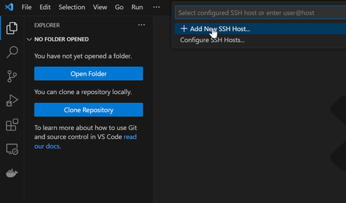
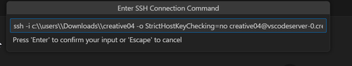
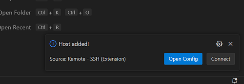
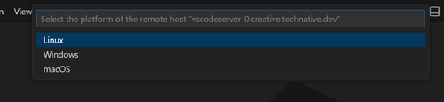
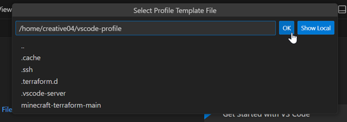
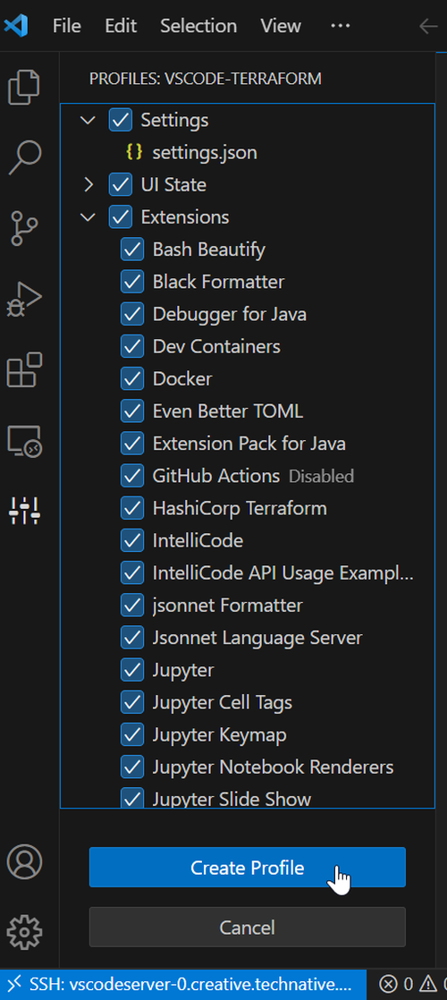
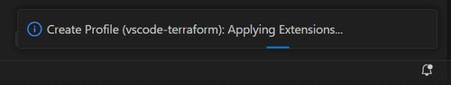
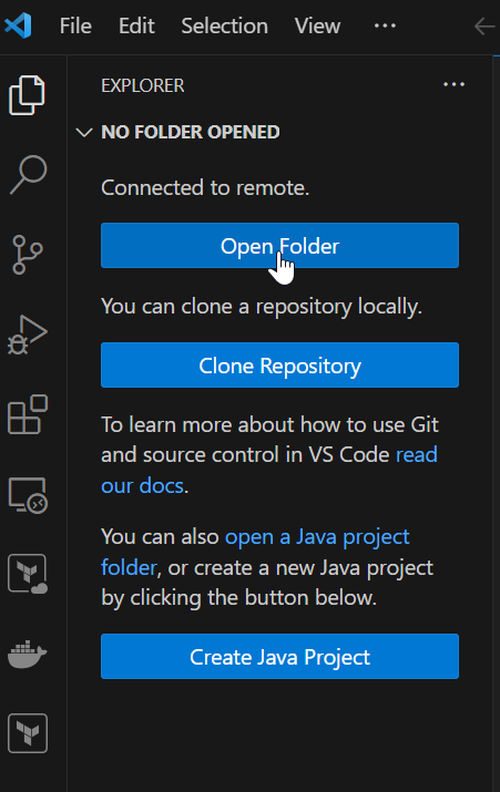
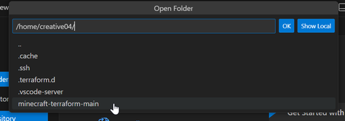
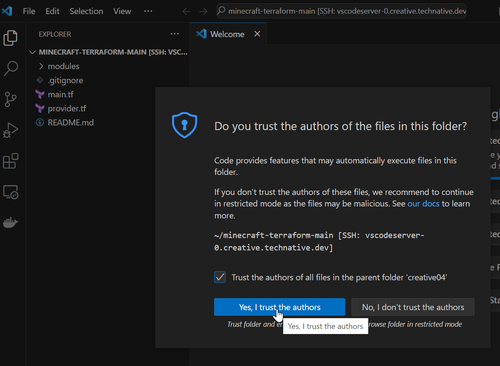

# Setup for the Event

## Step 1: Connect to WiFi

Today you'll need WiFi. Use our guest network:

Network: **TechnativeGuest**
Password: **J1cZtf9a4qvk1lteo4ul**


## Step 2: Download file and note the path
You'll receive an email with an attachment. The file is named `creativexy`, where xy is a sequence number. Here we use sequence number **04**. So the file is named `creative04`.

This file should be in the **Downloads** folder. That's the default location where things are downloaded from email or the internet.

Note the **_full path_** to this folder. For example, `c:\users\participant\downloads`.

Here's how to find it:

- In your browser's downloads, right-click the file and choose `Show in Explorer`. Note the path at the top. (For example: **C:\Users\Participant\Downloads**)

or

- In Windows, press **WIN** + **R** together. A window will open where you can type. Type **%userprofile%** and click **Run**. A new window opens with your Windows username at the top. The path you need to remember is **c:\users\username\downloads**.


## Step 3: Install Visual Studio Code

If you don't have Visual Studio Code yet, download and install it from the [official website](https://code.visualstudio.com/).

## Step 4: Setup Visual Studio Code

Open Visual Studio Code and do this:

- Click on the blue icon `><` at the bottom left.
- Click on SSH at the top center.


An **extension** will be installed. When it's done:

- Choose `+ Add New SSH Host`.



Now you need to enter a command:

1. Replace **creative04** with the name of the file you downloaded.
2. Replace **c:\users\user\downloads** with the path you noted in **Step 2**.
3. Double each backslash `\`.

- Enter this command:

```bash
ssh -i c:\\users\\user\\downloads\\creative04  -o StrictHostKeyChecking=no creative04@vscodeserver-0.creative.technative.dev
```



- Press **enter**.
- Choose `c:\users\user\.ssh\config`.


You'll see a message at the bottom saying a host has been added.



Great! The setup is done. Let's connect to the SSH Host.


## Step 5: Connect to SSH Host

Now we're going to connect to the SSH Host.
- Click on the blue icon `><` at the bottom left.
- Choose `Connect to Host....`.
- Click on `vscodeserver-0.creative.technative.dev`.

A new window will open, and the connection will be made.

The blue icon at the bottom left will expand. Instead of just `><`, it will now say `>< SSHL vscodeserver-0.creative.technative.dev`.

### Extra Note
You might get a message at the top: **Select the platform of the remote host**.

Choose **Linux**.



## Step 6: Configure Visual Studio Code

To make coding easier, we want to set up Visual Studio Code. We've prepared this already. We just need to create a profile.

- Click on the **configuration** icon at the bottom left.
- Choose **Profiles (Default)**.
- Click on **Import Profile**.


Click on **Select File**.


- Type `vscode-profile` and click **OK**.



Now you'll see a list of checkboxes on the left. At the bottom, there are two options.

- Click on **Create Profile**.



**vscode-terraform** is already filled in.
- Click on **Create**.


A new profile will be created. This will take a moment. Once it's done, Visual Studio Code needs to be reloaded.

- Click on **Reload**.



The program will reload, and the connection to the server will be restored automatically.

## Step 7: Ready to Go
We've prepared some code for you. Open it in Visual Studio Code.

- Click on the blue button **Open Folder** on the left.



- Click on **minecraft-terraform-main** at the top of the screen.



- Click on **Ok**.

You'll get a warning "Do you trust the authors of the files in this folder?"
- Check the box **Trust the authors of all files in the parent folder 'creative04'**, so a checkmark appears.
- Click on **Yes, I trust the authors**.



We'll need a **Terminal** to activate the code later.

- Click on **Terminal** at the top (if it's not there, click on the ... three dots first).
- Choose **New Terminal**.


### YES; you're ready!
All preparations are done.
Your screen should now look something like this:


# HAPPY CODING
